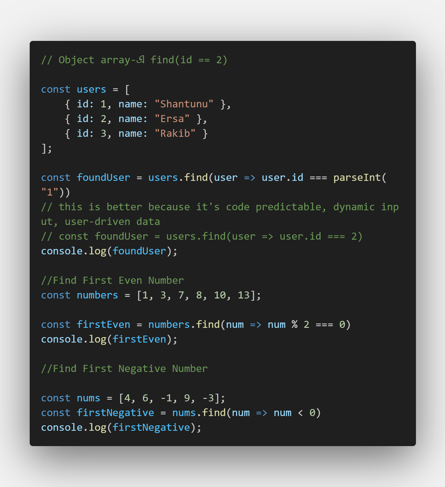
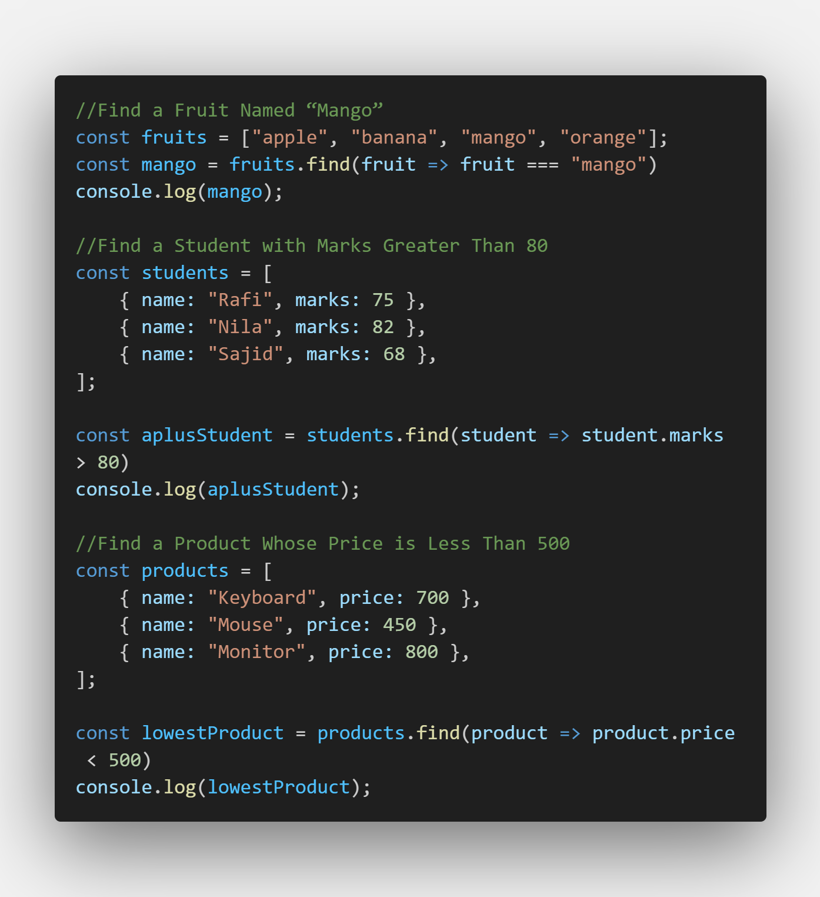
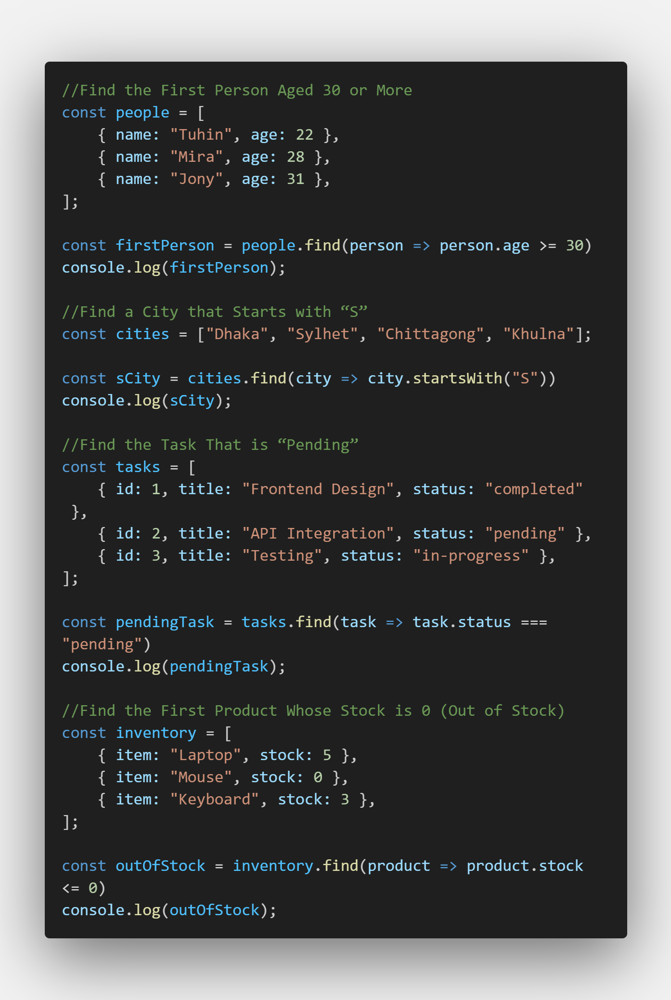
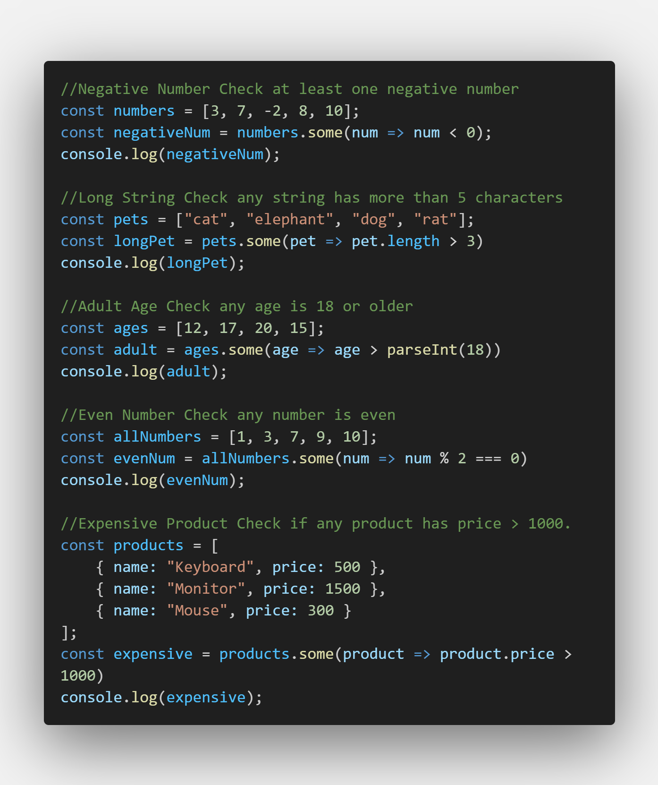

# 🔍 JavaScript Practice Problems — find() Method

---

## 🟢 Easy Level

1. Find First Even Number
2. Find First Negative Number
3. Find a Fruit Named “Mango”

---

## 🟡 Medium Level

4. Find a Student with Marks Greater Than 80
5. Find a Product Whose Price is Less Than 500
6. Find the First Person Aged 30 or More
7. Find a City that Starts with “S”

---

## 🔵 Real-World Level

8. Find the User with ID = 101
9. Find the Task That is “Pending”
10. Find the First Product Whose Stock is 0 (Out of Stock)
11. Find the first number that is a perfect square

---

## 🧠 Extra Concept Learned

- Understanding `startsWith(searchString, position)` method
- Difference between checking from index 0 vs a given position

## 🟢 Array Method Practice — some() & every()

### 🔹 some() Practice Problems

1. Check if an array contains at least one negative number
2. Check if an array of strings contains at least one string longer than 5 characters
3. Check if a list of ages contains at least one person older than 18
4. Check if an array of numbers contains at least one even number
5. Check if a list of products has at least one item with price > 1000

